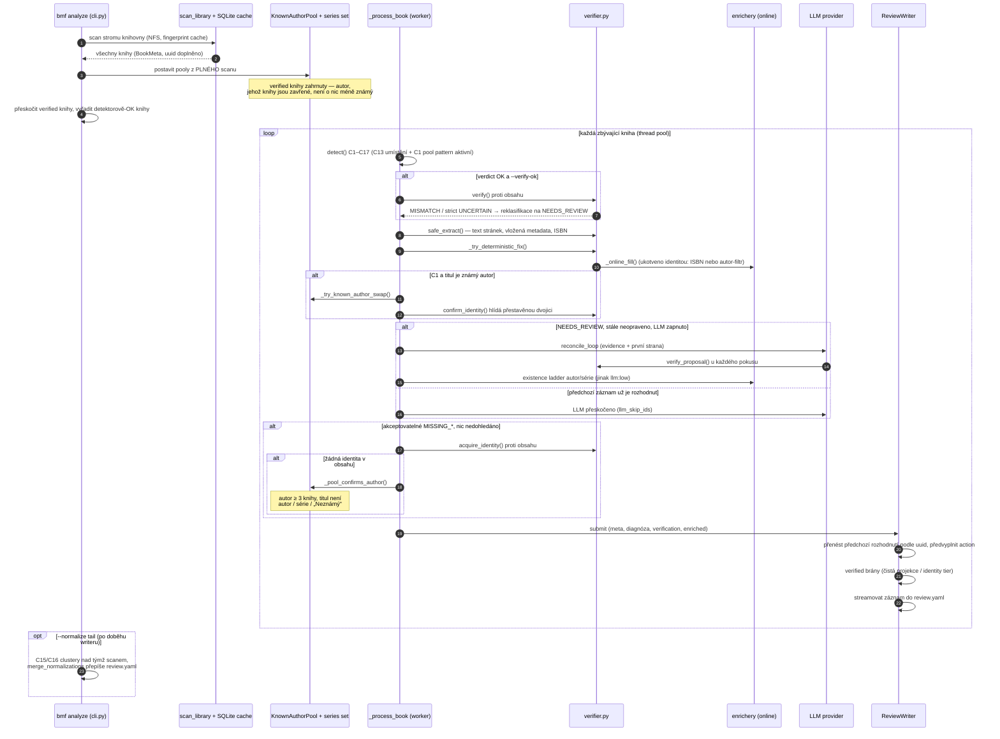
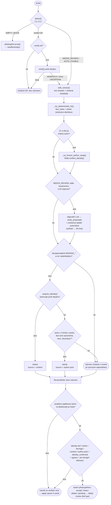
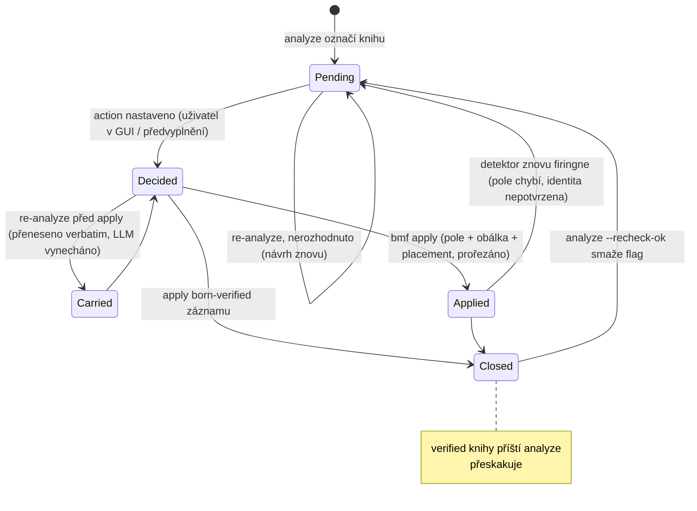

# UML diagramy

[English](../diagrams.md) | **Čeština**

Mermaid podoby tří toků, na kterých záleží: běh `bmf analyze` (sekvenční),
běh `bmf apply` (sekvenční), rozhodovací strom jedné knihy v analyze
(flowchart) a lifecycle review záznamu (stavový). Prózu — modulovou mapu a
datové toky — najdete v [architecture.md](../architecture.md), filozofii
verifikace a fix cascade v [concepts.md](../concepts.md) (obojí anglicky).

## 1. Sekvenční — `bmf analyze` (hlavní smyčka)

Jeden scan, potom každá ne-OK kniha projde fix cascade ve worker pool;
výsledky se streamují do `review.yaml` podle toho, jak dokončují.



## 2. Sekvenční — `bmf apply`

Spouští se jen rozhodnuté záznamy. Zápis metadat, pak placement (bývalý
`organize`), pak prořez. Nic tady znovu nečte obsah knihy — drahá
verifikace proběhla v analyze.

```mermaid
sequenceDiagram
	autonumber
	participant CLI as bmf apply
	participant RV as review.yaml + .bak
	participant AP as apply_review
	participant W as writers.py
	participant COV as covers.py
	participant MV as mover (placement)
	participant FS as disk knihovny

	CLI->>RV: načíst rozhodnuté záznamy (multi-doc + legacy)
	loop každý rozhodnutý záznam
		alt action accept nebo keep
			AP->>W: _apply_action() — proposed pole na BookMeta
			opt MISSING_COVER / C11 bez náhrady
				AP->>COV: cover_url z enricheru, jinak extrakt ze souboru knihy
			end
			W->>FS: atomický zápis metadata.json + metadata.opf<br/>(verified flag jen do json)
		else action delete (C6)
			AP->>FS: smazací snapshot (tar.gz), pak odstranit složku
		else action delete s proposed.delete_files (C17)
			AP->>FS: překontrolovat každý soubor, mazat jen stále-nevalidní
		end
		opt placement (default, --no-place vynechá)
			AP->>MV: _placement_target(), přepočítané z finálních metadat
			MV->>FS: přesun na pattern cestu / merge stejného díla / "(dup N)"<br/>EMPTY_BOOK → needfix/empty; rozhodnuto (accept/keep) → vždy pattern cesta
		end
	end
	AP->>RV: prořezat aplikované záznamy (keep zůstává, cesty přepsány)
	note over CLI: dokonči bmf abs-rescan, aby se<br/>diskové zápisy dostaly do Audiobookshelf
```

## 3. Rozhodování — jedna kniha analyze

Tierovaná logika `_process_book` + předvyplnění záznamu v `ReviewWriter`.
Nejsilnější důkaz vždy vyhrává; každé selhání nechá knihu v review s
nápovědou, místo aby se hádalo.



## 4. Stavy — lifecycle review záznamu / knihy

Proč akceptované knihy pořád znovu přibývají a co je doopravdy zavírá.



Stav `Closed` je jediný stabilní: kniha bez něj cyklí analyze → accept →
apply → analyze donekonečna, protože detektor poctivě firingne, dokud pole
chybí. Identity tier (content, author-pool, online, llm:high) jsou to, co
umožňuje analyze předvyplnit `verified` — viz [concepts.md](../concepts.md),
řádek `verified: true`.

## Co zde záměrně není

- **Class diagram datového modelu** (`BookMeta`, `Diagnosis`,
  `EnrichedMeta`, `IdentityResult`, dict review záznamu) — modely jsou malé
  a žijí v docstringech `models.py` / `enrichers.py`; diagram by je
  duplikoval a rozjel by se s nimi.
- **Komponentní / deploymen diagram** (bmf × NFS knihovna × SQLite cache ×
  online API × ABS server × LLM endpointy) — hodí se, až bude operací víc;
  kapitoly o enricherech/ABS v [architecture.md](../architecture.md) to
  dnes pokrývají prózou.
