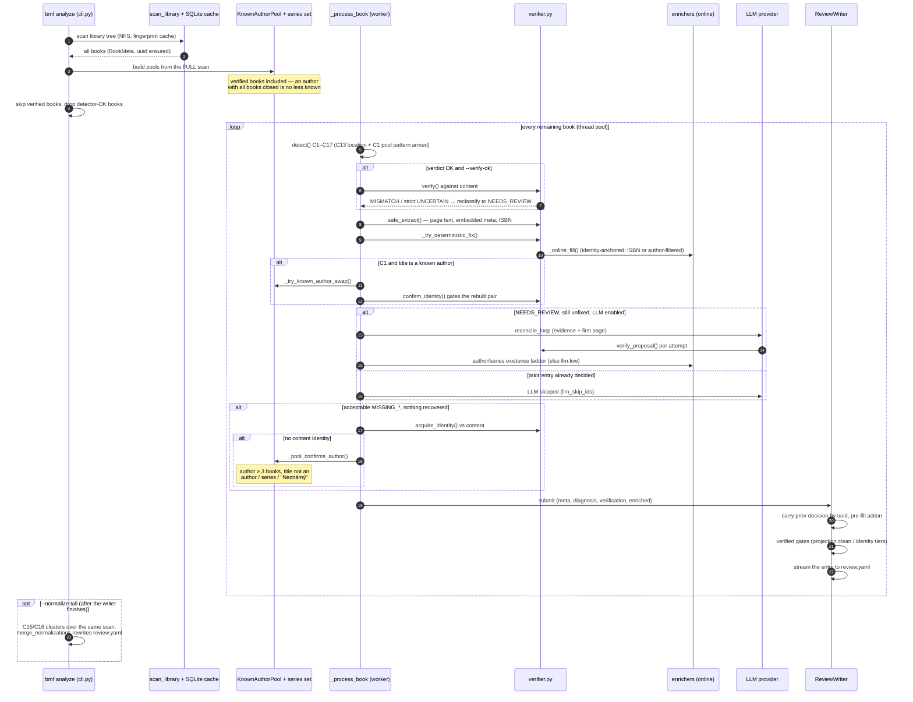
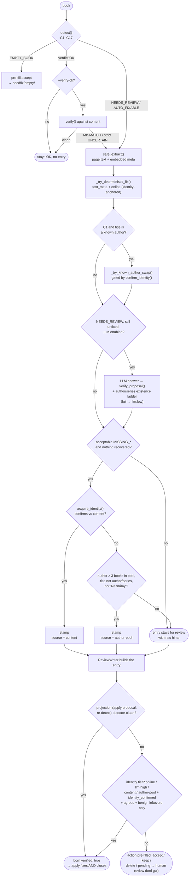
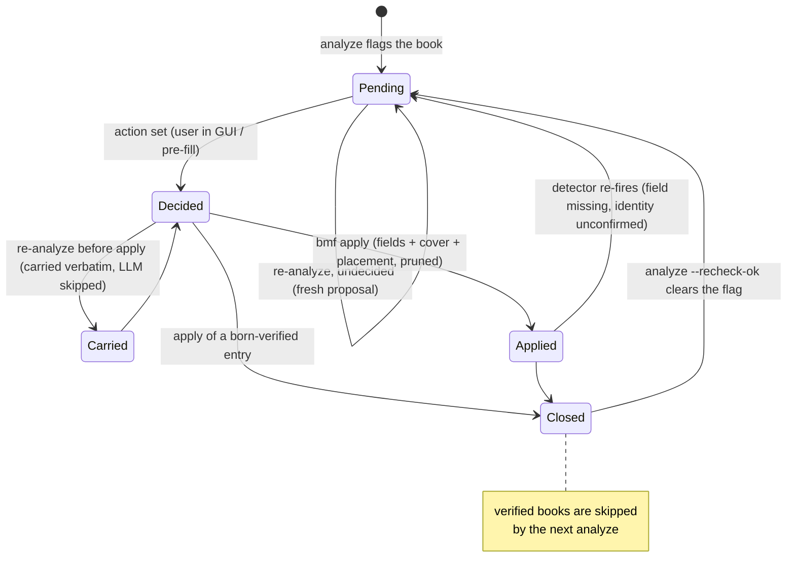

# UML Diagrams

**English** | [Čeština](cs/diagrams.md)

Mermaid renderings of the three flows that matter: the `bmf analyze` run
(sequence), the `bmf apply` run (sequence), the per-book decision tree in
analyze (flowchart), and the review-entry lifecycle (state). For the prose
versions see [architecture.md](architecture.md) (module map, data flow) and
[concepts.md](concepts.md) (verification philosophy, fix cascade, review.yaml
format).

## 1. Sequence — `bmf analyze` (the main loop)

One scan, then every non-OK book runs through the fix cascade in a worker
pool; results stream into `review.yaml` as they finish.



## 2. Sequence — `bmf apply`

Only decided entries are executed. Metadata writes, then placement (the
former `organize`), then pruning. Nothing here re-reads book content — the
expensive verification happened in analyze.

```mermaid
sequenceDiagram
	autonumber
	participant CLI as bmf apply
	participant RV as review.yaml + .bak
	participant AP as apply_review
	participant W as writers.py
	participant COV as covers.py
	participant MV as mover (placement)
	participant FS as library disk

	CLI->>RV: load decided entries (multi-doc + legacy)
	loop every decided entry
		alt action accept or keep
			AP->>W: _apply_action() — proposed fields onto BookMeta
			opt MISSING_COVER / C11 with no replacement yet
				AP->>COV: enricher cover_url, else extract from the book file
			end
			W->>FS: atomic write metadata.json + metadata.opf<br/>(verified flag → json only)
		else action delete (C6)
			AP->>FS: deletion snapshot (tar.gz), then remove folder
		else action delete with proposed.delete_files (C17)
			AP->>FS: re-check each file, delete only still-invalid ones
		end
		opt placement (default, --no-place skips)
			AP->>MV: _placement_target(), recomputed from final metadata
			MV->>FS: move to pattern path / merge same work / "(dup N)"<br/>EMPTY_BOOK → needfix/empty; decided (accept/keep) → always the pattern path
		end
	end
	AP->>RV: prune applied entries (keep retained, paths refreshed)
	note over CLI: finish with bmf abs-rescan to push<br/>the disk writes into Audiobookshelf
```

## 3. Decision — one book through analyze

The tiered logic of `_process_book` + the entry pre-fill in `ReviewWriter`.
Strongest evidence always wins; every failure leaves the book in review with
a hint instead of guessing.



## 4. State — the review entry / book lifecycle

Why accepted books keep re-appearing, and what actually closes them.



The `Closed` state is the only stable one: a book without it cycles
analyze → accept → apply → analyze forever, because the detector honestly
re-fires while the field is missing. The identity tiers (content,
author-pool, online, llm:high) are what lets analyze pre-fill `verified` —
see [concepts.md](concepts.md), the `verified: true` row.

## What is deliberately not here

- **Class diagram of the data model** (`BookMeta`, `Diagnosis`,
  `EnrichedMeta`, `IdentityResult`, the review-entry dict) — the models are
  small and live in `models.py` / `enrichers.py` docstrings; a diagram would
  duplicate them and drift.
- **Component / deployment diagram** (bmf × NFS library × SQLite cache ×
  online APIs × ABS server × LLM endpoints) — useful if the operational
  picture gets harder to hold in your head; the enricher/ABS chapters of
  [architecture.md](architecture.md) cover it in prose today.
